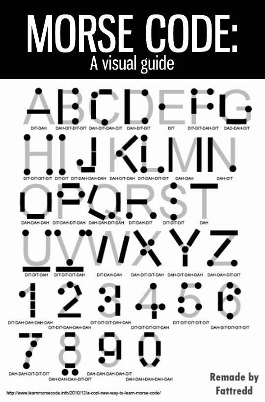
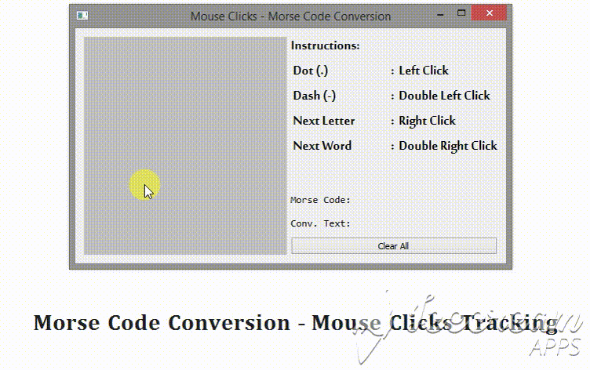

# Robust Morse Code Converter (Incomplete)

This 4-in-1 application can convert Morse Code signalled in 4 different ways in real time. Namely, flashlight toggles, eye winking, hand gestures and mouse clicks. 

## Code Requirements
* Numpy - 1.13.3
* OpenCV - 3.2.0
* PyQt5 - 5.9.2
* Dlib - 19.4.0
* Imutils - 0.4.6

## Execution
Order of Execution is as follows:

1. Follow these installation guides - [Numpy](https://pypi.org/project/numpy/), [OpenCV](https://medium.com/@akshaychandra21/f5f721f0d0b3), [PyAutoGUI](https://pyautogui.readthedocs.io/en/latest/install.html), [Dlib](https://www.learnopencv.com/install-opencv-3-and-dlib-on-windows-python-only/), [Imutils](https://github.com/jrosebr1/imutils), [PyQt5](http://pyqt.sourceforge.net/Docs/PyQt5/installation.html) and install the **right versions** of the libraries (mentioned above).
2. Make sure you have the model downloaded. Read the README.txt file inside the model folder for the link. 
3. `python main.py`

## Morse Code
Morse code is a method of transmitting text information as a series of on-off tones, lights, or clicks that can be directly understood by a skilled listener or observer without special equipment. It is named for Samuel F. B. Morse, an inventor of the telegraph. Morse code has been in use for more than 160 years—longer than any other electrical coding system.

 

 
.    .     .  

<i>Former Source: Morse Code (Wikipedia). Latter source is on the image.</i> 

### Applications for the general public
An important application is signalling for help through SOS, "··· --- ···". This can be sent many ways: keying a radio on and off, flashing a mirror, toggling a flashlight, and similar methods. SOS is not three separate characters, rather, it is a prosign SOS, and is keyed without gaps between characters.

 

<i>A U.S. Navy signalman sends Morse code signals in 2005.  Source: Morse Code (Wikipedia)</i>

### Morse code as an assistive technology
Morse code has been employed as an assistive technology, helping people with a variety of disabilities to communicate. Morse can be sent by persons with severe motion disabilities, as long as they have some minimal motor control. An original solution to the problem that caretakers have to learn to decode has been an electronic typewriter with the codes written on the keys. Codes were sung by users; see the voice typewriter employing morse or votem, Newell and Nabarro, 1968.

Morse code can also be translated by computer and used in a speaking communication aid. In some cases, this means alternately blowing into and sucking on a plastic tube ("sip-and-puff" interface). An important advantage of Morse code over row column scanning is that once learned, it does not require looking at a display. Also, it appears faster than scanning.

_Note: The entire text and most of the images are from the [Morse Code Wikipedia page](https://en.wikipedia.org/wiki/Morse_code) [[2](#references)]._

## Hand Gestures
*Under development.*

*Currently, I am working on training an object detection model in TensorFlow to detect hands. I will be training the model on [EgoHands Dataset](http://vision.soic.indiana.edu/projects/egohands/) [[7](#references)].*

## Eye Winking

This module is deeply centered around predicting the facial landmarks of the given face in a video. We can accomplish a lot of things using these landmarks. From detecting eye-blinks [[3](#references)] in a video to predicting emotions of the subject. The applications, outcomes and possibilities of facial landmarks are immense and intriguing.

[Dlib](dlib.net/)'s prebuilt model, which is essentially an implementation of [[4](#references)], not only does a fast face-detection but also allows us to accurately predict 68 2D facial landmarks. Very handy. Also Adrian Rosebrock's imutils package was super helpful [[5](#references)], checkout his tutorials at [[3](#references)].

 

Using these predicted landmarks of the face, we can build appropriate features that will further allow us to detect certain actions, like using the eye-aspect-ratio (more on this below) to detect a blink or a wink. In this project, these actions are programmed as triggers the inputs - "dits" and "dahs". 

### Eye-Aspect-Ratio (EAR)
You will see that Eye-Aspect-Ratio [[1](#references)] is the simplest and the most elegant feature that takes good advantage of the facial landmarks. EAR helps us in detecting blinks [[3](#references)] and winks etc.  

You can see that the EAR value drops whenever the eye closes. We can train a simple classifier to detect the drop. However, a normal if condition works just fine. 

## Flashlight Toggling
*Under development.*

*I will do this in the end as this will not require any deep learning and only demands an efficient use of some image processing tools already available on OpenCV.*

## Mouse Clicks Tracking

This module could be the least useful of all. But my motivation was to create an interface where one need not type anything explicitly but still would want to convey the message with just the mouse clicks. One way to look at this is to send the message across discreetly with just the mouse clicks. 

I understand the practical usage of this module is limited but then I thought, "Why not?". I created the GUI using PyQt5 that allows the user to click in a specified input space and it converts the clicks into morse code and then the morse code to text. 

 

 <i> Note: Red circles imply right click. </i> 

Maybe this would be helpful when you are trying to get rid of an annoying co-worker and want to send the message to someone to free you from the misery (I will add the mailing feature soon). I will leave it to your imaginations. 

## References
- **[1]**. Tereza Soukupova´ and Jan Cˇ ech. _[Real-Time Eye Blink Detection using Facial Landmarks](https://vision.fe.uni-lj.si/cvww2016/proceedings/papers/05.pdf)_. In 21st Computer Vision Winter Workshop, February 2016.

- **[2]**. Morse Code Wikipedia. [https://en.wikipedia.org/wiki/Morse_code](https://en.wikipedia.org/wiki/Morse_code).

- **[3]**. Adrian Rosebrock. _[Eye blink detection with OpenCV, Python, and dlib](https://www.pyimagesearch.com/2017/04/24/eye-blink-detection-opencv-python-dlib/)_.

- **[4]**. Vahid Kazemi, Josephine Sullivan. _[One millisecond face alignment with an ensemble of regression trees](https://ieeexplore.ieee.org/document/6909637)_. In CVPR, 2014.

- **[5]**. Adrian Rosebrock. *Imutils*. [https://github.com/jrosebr1/imutils](https://github.com/jrosebr1/imutils). 

- **[6]**. PyQt5 Tutorials. *zetcode.com*. [http://zetcode.com/gui/pyqt5/](http://zetcode.com/gui/pyqt5/).

-  **[7]**. Bambach, Sven and Lee, Stefan and Crandall, David J. and Yu, Chen. *[Lending A Hand: Detecting Hands and Recognizing Activities in Complex Egocentric Interactions](http://vision.soic.indiana.edu/projects/egohands/)*. The IEEE International Conference on Computer Vision (ICCV), December 2015.